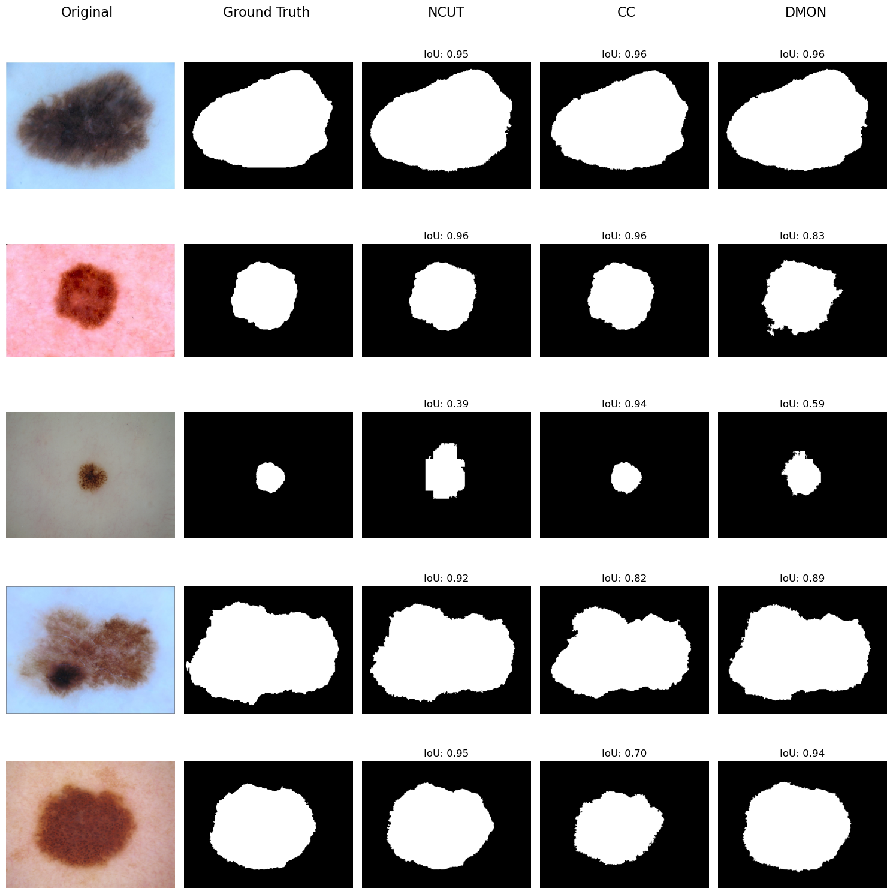
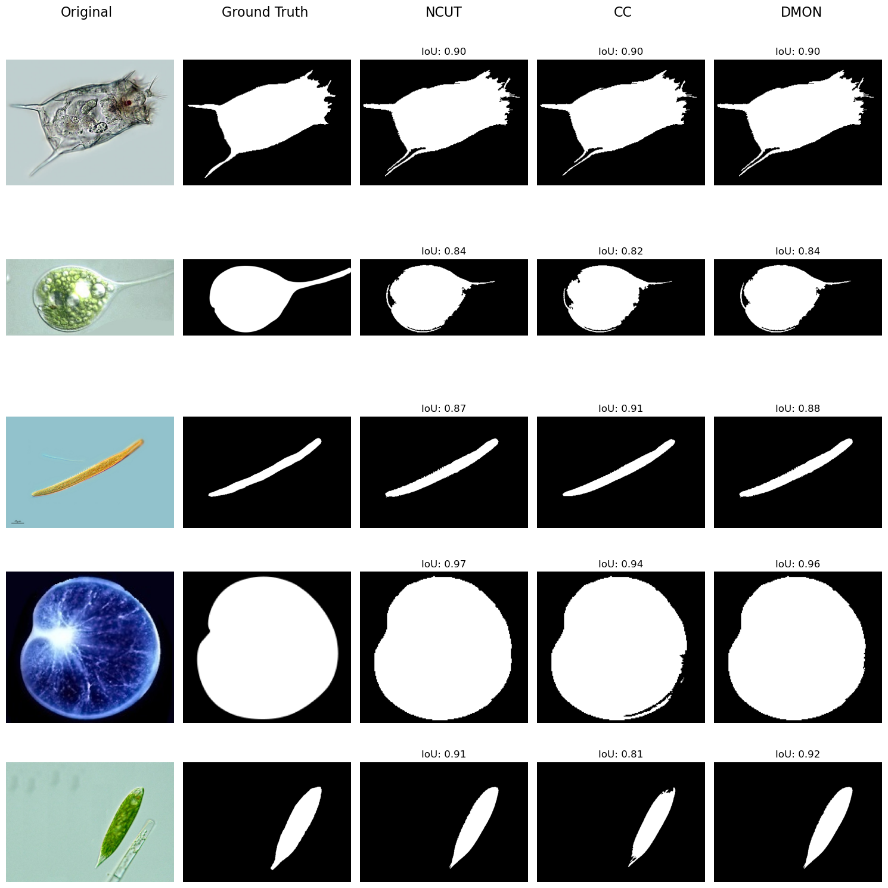

# Unsupervised Image Segmentation With GNNs

This repository contains code and data for unsupervised image segmentation using Graph Neural Networks (GNNs). The project includes various datasets, feature extraction methods, and models for segmentation,based on mainly two parer : [UNSEGGNET: UNSUPERVISED IMAGE SEGMENTATION USING
GRAPH NEURAL NETWORKS](https://arxiv.org/pdf/2405.06057v1) and [DeepCut: Unsupervised Segmentation using Graph Neural Networks Clustering.](https://arxiv.org/pdf/2212.05853)


## Setup

1. Clone the repository:
    ```sh
    git clone git@github.com:Devnetly/Image_Segmentation_With_GNNs.git
    cd Image_Segmentation_With_GNNs
    ```

2. Install the required dependencies:
    ```sh
    pip install -r requirements.txt
    ```

## Usage

### Evaluation

```sh
cd src/segmentation
python3 evaluate.py [-h] [--model_name MODEL_NAME] [--feature_type FEATURE_TYPE] [--layer LAYER] [--stride STRIDE] [--resize RESIZE] [--segmentation_type SEGMENTATION_TYPE] [--threshold THRESHOLD] [--alpha ALPHA] [--activation ACTIVATION] [--num_layers NUM_LAYERS] [--conv_type CONV_TYPE] [--hidden_dim HIDDEN_DIM] [--num_clusters NUM_CLUSTERS][--device DEVICE] [--lr LR] [--n_iters N_ITERS] [--dataset DATASET] [--output_dir OUTPUT_DIR]
```

### Demo

```sh
python3 demo.py
```

## Results

### ISIC Dataset

#### Examples : 



#### Results across the different combinations of losses/layers : 

| Loss  | Layer                        | IoU   | Dice  | Best Epoch |
|-------|------------------------------|-------|-------|------------|
| NCUT  | GCN                          | 0.622 | 0.708 | 90         |
| NCUT  | GAT                          | 0.338 | 0.409 | 100        |
| NCUT  | ARMA                         | 0.623 | 0.714 | 30         |
| CC    | GCN (without normalization)  | 0.434 | 0.539 | 20         |
| CC    | GAT                          | 0.158 | 0.219 | 80         |
| DMON  | GCN                          | 0.363 | 0.483 | 100        |
| DMON  | GAT                          | 0.378 | 0.498 | 90         |
| DMON  | ARMA                         | 0.500 | 0.606 | 80         |


### EMD6 Dataset

#### Example : 


<br />

#### Results across the different combinations of losses/layers : 


| Loss  | Layer                        | IoU   | Dice  | Best Epoch |
|-------|------------------------------|-------|-------|------------|
| NCUT  | GCN                          | 0.642 | 0.723 | 50         |
| NCUT  | GAT                          | 0.519 | 0.599 | 100        |
| NCUT  | ARMA                         | 0.649 | 0.731 | 30         |
| CC    | GCN (without normalization)  | 0.543 | 0.636 | 40         |
| CC    | GAT                          | 0.157 | 0.222 | 100        |
| DMON  | GCN                          | 0.269 | 0.388 | 70         |
| DMON  | GAT                          | 0.273 | 0.390 | 90         |
| DMON  | ARMA                         | 0.453 | 0.558 | 80         |